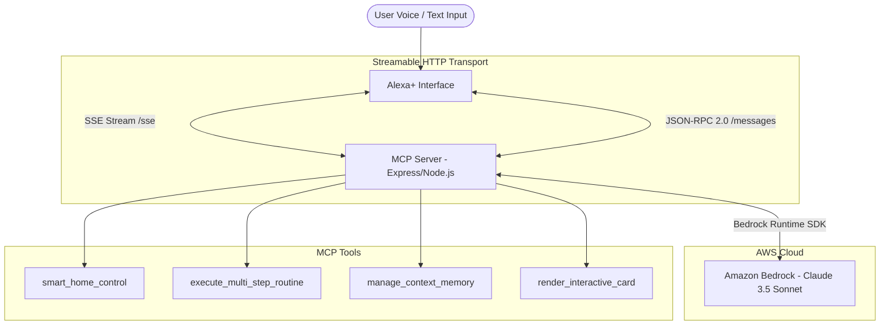

# Aura+

[](LICENSE)
[](https://amazonappdev2026.devpost.com/)
[](https://modelcontextprotocol.io/)
[](https://aws.amazon.com/bedrock/)

> Autonomous ambient agent and self-hosted Model Context Protocol (MCP) server for Alexa+ with AWS Bedrock reasoning, multi-model failover, and interactive digital twin telemetry.

---

## What is Aura+?

Aura+ is a self-hosted MCP server and ambient Alexa+ agent that goes beyond traditional single-turn voice skills. Instead of "ask a question, get an answer," Aura+ plans and executes multi-step tasks across connected smart homes, persists user context across sessions, and renders interactive controls directly on screen.

It runs on the open **Streamable HTTP** transport (MCP Spec 2025-11-25+) and connects with **AWS Bedrock** (Claude 3.5 Sonnet & Amazon Nova) for reasoning and tool selection. When AWS credentials are not configured, it seamlessly runs an autonomous simulation engine for zero-config local development and testing.

---

## Architecture



---

## Key Features

**MCP Server**
- Full Streamable HTTP implementation with SSE (`/sse`) and JSON-RPC 2.0 (`/messages`)
- 4 registered tools: device control, multi-step routines, persistent memory, and visual card rendering
- MCP Resources for user profile (`alexa://user/profile`) and system telemetry (`alexa://system/telemetry`)

**AWS Bedrock Multi-Model Quota Failover**
- Multi-Model Cascade: Primary (Claude 3.5 Sonnet) ➔ Amazon Nova Pro ➔ Claude 3 Haiku ➔ Amazon Nova Lite ➔ Gemini / OpenAI ➔ Offline Simulator
- Automatic quota & rate limit detection (`ThrottlingException`, HTTP 429, capacity limits) with zero-downtime hot-swapping
- Interactive "Simulate Quota Limit" test toggle in UI with Execution Trace waterfall telemetry
- Built-in offline autonomous simulator for comprehensive local testing without requiring external cloud credentials

**Web Interface (4 Views)**
- **Orchestrator Console** — command bar with voice input, one-click workflow chips, hierarchical agent plan tree, and expandable tool call disclosures showing JSON-RPC arguments and results
- **Execution Trace** — waterfall visualization of each span (model reasoning, tool execution, SSE broadcast) with a calibrated 0-480ms ruler
- **Power Grid & Telemetry** — interactive solar/load area chart with crosshair scrubber, Tesla Powerwall 3 battery tank, and multi-zone climate controller
- **Device Topology** — digital twin matrix showing all connected devices with live state and toggle controls

**Audio & Voice**
- Web Audio API chimes for wake and success feedback
- Browser SpeechRecognition for voice input
- SpeechSynthesis TTS for Alexa-style spoken responses

---

## User Interface & Interactive Views

| 1. Orchestrator Console & Hierarchical Agent Plan | 2. Execution Trace & Latency Waterfall |
| :---: | :---: |
|  |  |
| *Natural language command bar, routine chips, agent plan tree & live MCP tool disclosures* | *Sub-millisecond waterfall spans, 0-480ms ruler & multi-model quota failover cascade* |

| 3. Power Grid & Telemetry | 4. Connected Device Matrix (Digital Twin) |
| :---: | :---: |
|  |  |
| *Interactive solar scrubber, Tesla Powerwall 3 battery mode & multi-zone climate hub* | *Real-time digital twin matrix synchronized via Streamable HTTP tool calls* |

---

## Quick Start

**Prerequisites:** Node.js v18+, npm v9+

```bash
git clone https://github.com/Sidopolis/ambient-alexa-mcp.git
cd ambient-alexa-mcp
npm start
```

Open `http://localhost:3000` in your browser.

Run the test suite:
```bash
npm test
```
This runs 16 tests covering MCP tool schemas, execution engine, intent parsing, and multi-model quota failover.

---

## AWS Bedrock Setup (Optional)

Create `server/.env`:
```env
AWS_REGION=us-east-1
AWS_ACCESS_KEY_ID=your_access_key
AWS_SECRET_ACCESS_KEY=your_secret_key
BEDROCK_MODEL_ID=anthropic.claude-3-5-sonnet-20240620-v1:0
PORT=3000
```
Restart the server. Aura+ detects the credentials and routes queries through Bedrock automatically.

Without this file, the built-in intent engine handles all requests locally.

---

## MCP Tools & Resources

### Tools (`tools/list` & `tools/call`)
| Tool | Parameters | What it does |
| :--- | :--- | :--- |
| `smart_home_control` | `deviceId`, `action`, `value` | Controls lights, thermostats, locks, speakers |
| `execute_multi_step_routine` | `routineName`, `steps[]` | Runs sequential multi-device routines |
| `manage_context_memory` | `operation`, `key`, `value` | Persists user preferences across sessions |
| `render_interactive_card` | `cardType`, `title`, `details` | Renders UI cards on the visual surface |

### Resources (`resources/list` & `resources/read`)
| URI | Type | Content |
| :--- | :--- | :--- |
| `alexa://user/profile` | `application/json` | Device topology, routines, and todo list |
| `alexa://system/telemetry` | `application/json` | Uptime, SSE connections, protocol health |

---

## Developer Experience & Friction Log

See [FRICTION_LOG.md](FRICTION_LOG.md) for detailed observations on Streamable HTTP session binding across reconnects, Bedrock schema interoperability, and real-time state synchronization.

---

## Public Deployment

### Option 1: Render (Recommended for Streamable HTTP SSE)
Aura+ uses continuous Server-Sent Events (`/sse`) for real-time telemetry and MCP session binding. Platforms that support persistent Node.js processes (such as Render, Railway, or Fly.io) maintain open SSE connections indefinitely without serverless execution timeouts.

1. Fork or push to your GitHub repository.
2. Sign in to [Render](https://render.com) and click **New + ➔ Web Service** (or use the blueprint with `render.yaml`).
3. Set:
   - **Build Command**: `npm install`
   - **Start Command**: `npm start`
4. *(Optional)* Add your `AWS_ACCESS_KEY_ID` and `AWS_SECRET_ACCESS_KEY` under Environment Variables.
5. Your service will be live at `https://your-app.onrender.com`.

### Option 2: Vercel (Serverless / Static Preview)
For serverless hosting or frontend previews, a `vercel.json` configuration is provided in the repository. Note that on serverless architectures, individual lambda execution timeouts (10s on free Hobby tier) will periodically reconnect the SSE stream, but standard JSON-RPC tool calling and UI simulation remain fully functional.

1. Install the Vercel CLI: `npm i -g vercel`
2. Run `vercel` from the project root and follow the prompts.

---

## Contributing

Contributions, bug reports, and feature requests are welcome! See our [CONTRIBUTING.md](CONTRIBUTING.md) for architecture guidelines, MCP tool registration standards, and local testing instructions.

---

## License

[MIT](LICENSE)
