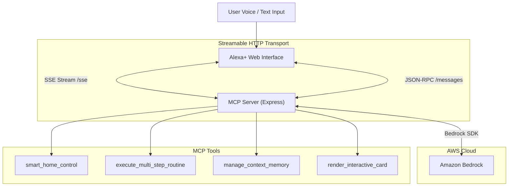
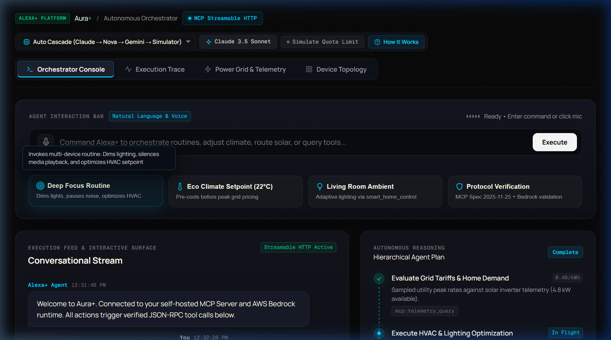
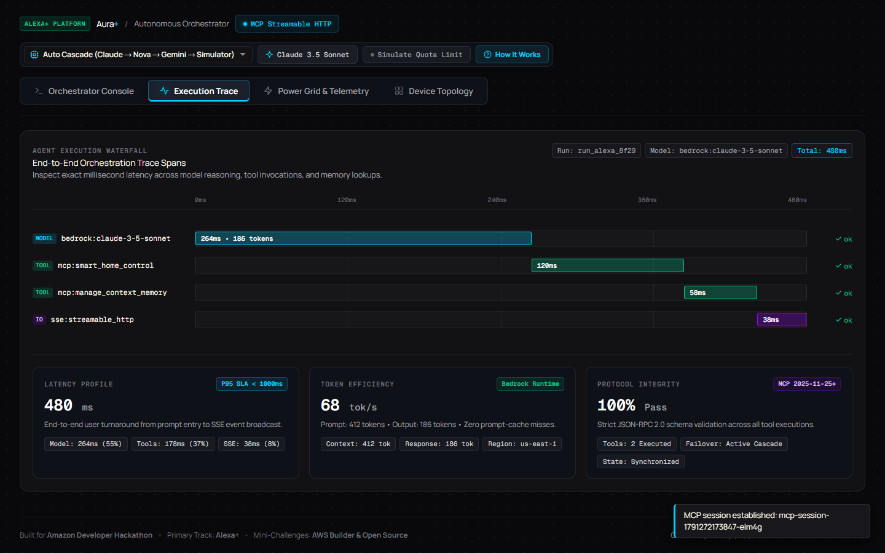
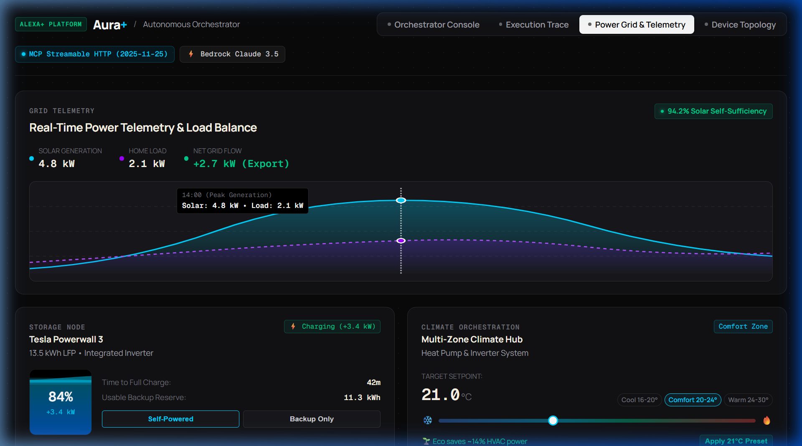
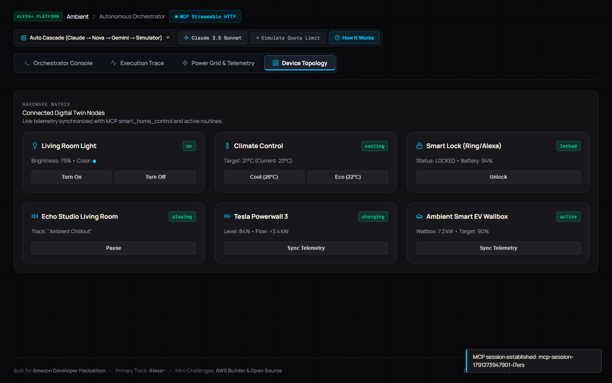

<p align="center">
  
</p>

# Ambient

[](LICENSE)
[](https://modelcontextprotocol.io/)
[](https://aws.amazon.com/bedrock/)

A self-hosted Model Context Protocol (MCP) server and web dashboard for Alexa+, powered by AWS Bedrock.

---

## Overview

Ambient connects an Alexa+ interface to smart home devices through the Model Context Protocol (MCP). Unlike traditional single-turn voice skills, Ambient can break down complex requests into multi-step routines, save user preferences across sessions, and show interactive controls directly on screen.

It uses the open **Streamable HTTP** transport (MCP Spec 2025-11-25+) with Server-Sent Events (SSE) and JSON-RPC 2.0. For reasoning, it calls **AWS Bedrock** (Claude 3.5 Sonnet and Amazon Nova). If AWS credentials are not set, it uses a local simulator so you can test everything out of the box.

---

## Architecture



---

## Screenshots

| Orchestrator Console | Execution Trace |
| :---: | :---: |
|  |  |
| *Command bar, quick routines, agent plan tree, and tool calls* | *Trace waterfall showing latency across model, tools, and SSE* |

| Power Grid & Telemetry | Device Topology |
| :---: | :---: |
|  |  |
| *Solar generation curve, Powerwall controls, and climate setpoint* | *Digital twin device grid with live status toggles* |

---

## Features

- **Streamable HTTP MCP Server**: Conforms to the MCP Spec (2025-11-25+) with `/sse` for event streaming and `/messages` for JSON-RPC 2.0 requests.
- **AWS Bedrock Integration**: Uses `@aws-sdk/client-bedrock-runtime` for tool calling and reasoning with Claude 3.5 Sonnet and Amazon Nova Pro.
- **Model Fallback**: If Bedrock hits a rate limit (HTTP 429 / ThrottlingException), the server automatically falls back to secondary models or the local simulator.
- **Interactive Web Interface**: 4 tab views (Console, Trace, Energy, Devices) with voice input, audio cues, and responsive controls.
- **Context Memory**: Persists user settings and preferences across sessions via MCP resource and tool endpoints.

---

## Getting Started

### Prerequisites

- Node.js 18+
- npm 9+

### Run Locally

1. Clone the repository and install dependencies:
   ```bash
   git clone https://github.com/Sidopolis/ambient-alexa-mcp.git
   cd ambient-alexa-mcp
   npm install
   ```

2. Start the server:
   ```bash
   npm start
   ```

3. Open `http://localhost:3000` in your browser.

4. Run the test suite:
   ```bash
   npm test
   ```
   Runs 16 unit tests covering MCP tool schemas, tool execution, intent parsing, and fallback logic.

---

## AWS Bedrock Configuration (Optional)

To connect directly to AWS Bedrock instead of the local simulator, add a `server/.env` file:

```env
AWS_REGION=us-east-1
AWS_ACCESS_KEY_ID=your_access_key
AWS_SECRET_ACCESS_KEY=your_secret_key
BEDROCK_MODEL_ID=anthropic.claude-3-5-sonnet-20240620-v1:0
PORT=3000
```

Restart the server to apply the changes.

---

## MCP Tools & Resources

### Registered Tools (`tools/list` & `tools/call`)

| Tool | Parameters | Description |
| :--- | :--- | :--- |
| `smart_home_control` | `deviceId`, `action`, `value` | Controls lights, thermostat, lock, and speakers |
| `execute_multi_step_routine` | `routineName`, `steps[]` | Runs a sequence of actions across multiple devices |
| `manage_context_memory` | `operation`, `key`, `value` | Reads and writes user preferences across sessions |
| `render_interactive_card` | `cardType`, `title`, `details` | Sends visual cards to the client display |

### Resources (`resources/list` & `resources/read`)

| URI | MIME Type | Description |
| :--- | :--- | :--- |
| `alexa://user/profile` | `application/json` | Current device states, routines, and user todo list |
| `alexa://system/telemetry` | `application/json` | Server uptime, active SSE clients, and protocol health |

---

## Developer Experience & Friction Log

See [FRICTION_LOG.md](FRICTION_LOG.md) for notes on MCP session binding, Bedrock tool schema formats, and client-server state synchronization.

---

## Contributing

See [CONTRIBUTING.md](CONTRIBUTING.md) for guidelines on code standards, adding new MCP tools, and running tests.

---

## License

[MIT](LICENSE)
